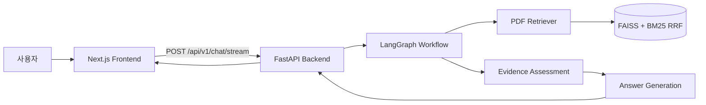

# 청년수당 RAG 챗봇

> 청년수당 참여자 안내책자를 기반으로 질문에 답변하고, 답변 근거가 된 PDF 페이지와 문단을 함께 제공하는 로컬 RAG 웹앱입니다.

## 데모

- 시연 영상: 별도 업로드 예정
- 실행 방식: 로컬 FastAPI 백엔드 + Next.js 프론트엔드
- 기준 문서: `Data/청년수당 참여자 안내책자.pdf`

## 프로젝트 개요

청년수당 참여자는 카드 사용처, 증빙, 자격상실, 참여 중단 등 여러 안내 사항을 PDF 안내책자에서 직접 찾아야 합니다. 이 프로젝트는 PDF 안내책자를 검색 가능한 지식 기반으로 만들고, 사용자가 자연어로 질문하면 관련 근거를 찾아 답변하는 RAG 챗봇입니다.

단순히 LLM에게 질문을 넘기는 방식이 아니라, 안내책자에서 검색된 근거가 충분할 때만 답변을 생성합니다. PDF에서 확인되지 않은 질문은 일반 지식으로 추측하지 않고 `insufficient_pdf_evidence` 상태와 `needs_external_search=true`를 반환하도록 설계했습니다.

## 주요 기능

- PDF 안내책자 텍스트 추출 및 Chroma 벡터 인덱싱
- 사용자 질문에 대한 PDF 기반 질의응답
- 답변별 출처 페이지, 청크 ID, 관련 문단 excerpt 표시
- LangGraph 기반 RAG 처리 흐름 구성
- 근거 부족 시 안전한 fallback 응답 반환
- FastAPI 기반 `/health`, `/chat`, `/chat/stream` API 제공
- Next.js 기반 채팅 UI, 빠른 질문 버튼, 출처 목록 렌더링
- 채팅 기록은 서버에 저장하지 않고 브라우저 세션 상태로만 유지

## 기술 스택

| 영역 | 기술 |
| --- | --- |
| Frontend | Next.js, React, TypeScript, Vitest |
| Backend | FastAPI, Python, Pydantic |
| RAG | LangChain, LangGraph |
| Vector Store | Chroma |
| LLM | OpenAI Chat Model, OpenAI Embeddings |
| Observability | LangSmith optional tracing |
| Test | pytest, Vitest |

## 아키텍처



## RAG 처리 흐름

1. 사용자가 프론트엔드에서 질문을 입력합니다.
2. 프론트엔드는 기본적으로 `POST /api/v1/chat/stream`으로 질문, 탭 단위 `thread_id`, 최근 대화 최대 4개를 전달합니다.
3. 백엔드는 FAISS와 BM25 결과를 RRF로 결합해 PDF 청크를 검색합니다. FAISS 장애 시 로컬 PDF 텍스트 기반 BM25를 시도합니다.
4. LangGraph 워크플로가 검색 결과의 근거 충분성을 판단합니다.
5. 근거가 충분하면 PDF 근거만 사용해 답변을 생성하고, 스트리밍 요청에서는 답변 토큰을 순차적으로 보냅니다.
6. 근거가 부족하면 답변을 추측하지 않고 fallback 응답을 반환합니다.
7. 프론트엔드는 답변과 출처 목록을 함께 렌더링합니다.

## 핵심 구현 포인트

### 1. 출처 추적 가능한 PDF 인덱싱

PDF를 단순 텍스트로만 저장하지 않고, 각 청크에 `source`, `page`, `chunk_id`, `excerpt` 메타데이터를 함께 보존했습니다. 이를 통해 답변 생성 후 사용자에게 "어떤 페이지의 어떤 문단을 근거로 답했는지"를 보여줄 수 있습니다.

### 2. 근거 부족 응답 정책

RAG 챗봇에서 가장 중요한 문제는 근거 없는 답변 생성입니다. 이 프로젝트는 검색 결과가 없거나, 검색된 청크만으로 답변하기 어렵다고 판단되면 일반 지식으로 답하지 않습니다.

```json
{
  "status": "insufficient_pdf_evidence",
  "needs_external_search": true
}
```

### 3. 확장 가능한 LangGraph 워크플로

질문 처리는 `retrieve_pdf`, `assess_evidence`, `generate_answer`, `fallback_no_answer` 단계로 분리했습니다. 이후 공식 출처 검색, 관리자 문서 업로드, 답변 품질 평가 같은 기능을 추가할 수 있도록 RAG 흐름을 노드 단위로 구성했습니다.

## API 계약

### `GET /health`

```json
{
  "status": "ok"
}
```

### `POST /api/v1/chat`

기존 `POST /chat`은 임시 호환 경로이며 deprecated입니다. 제거 버전과 날짜는 아직
정해지지 않았으며, 확정 전에는 `Sunset` 헤더를 보내지 않습니다.

요청:

```json
{
  "question": "청년수당 카드는 어디에서 사용할 수 있나요?",
  "thread_id": "browser-tab-uuid",
  "history": []
}
```

PDF 근거 기반 답변:

```json
{
  "answer": "안내책자 근거를 바탕으로 생성된 답변입니다.",
  "sources": [
    {
      "type": "pdf",
      "title": "청년수당 참여자 안내책자",
      "page": 12,
      "excerpt": "관련 문단 일부...",
      "chunk_id": "pdf-page-12-chunk-2"
    }
  ],
  "status": "answered_from_pdf",
  "needs_external_search": false
}
```

근거 부족 응답:

```json
{
  "answer": "안내책자에서 해당 내용을 확인하지 못했습니다. 최신 공식 안내 확인이 필요할 수 있습니다.",
  "sources": [],
  "status": "insufficient_pdf_evidence",
  "needs_external_search": true
}
```

### `POST /api/v1/chat/stream`

요청 body는 `/api/v1/chat`과 동일합니다. 응답은 `text/event-stream`이며 프론트엔드는 `token` 이벤트로 답변을 누적하고 `done` 이벤트에서 출처와 상태를 확정합니다.

`thread_id`는 브라우저 탭 식별용이며 서버 세션 저장 키로 사용하지 않습니다. 최근 문맥은 프론트엔드가 `history`로 전달하고 서버는 요청 종료 후 폐기합니다.

```text
event: token
data: {"text":"안내책자 근거로 "}

event: done
data: {"answer":"안내책자 근거로 확인한 답변입니다.","sources":[],"status":"answered_from_pdf","needs_external_search":false,"intent":"rag"}
```

## 프로젝트 구조

```text
backend/
  app/
    api/
    core/
    graph/
    indexing/
    rag/
  tests/
frontend/
  app/
  components/
  lib/
  __tests__/
docs/
Data/
```

## 실행 방법

### 1. 환경 변수 설정

프로젝트 루트에 `.env` 파일을 생성합니다.

```env
OPENAI_API_KEY=...
OPENAI_CHAT_MODEL=gpt-4o-mini
OPENAI_EMBEDDING_MODEL=text-embedding-3-small
LANGSMITH_TRACING=false
LANGSMITH_API_KEY=...
LANGSMITH_PROJECT=youth-allowance-rag
PDF_PATH=Data/청년수당 참여자 안내책자.pdf
CHROMA_DIR=backend/storage/chroma
RETRIEVAL_TOP_K=5
MIN_SIMILARITY_SCORE=0.2
NEXT_PUBLIC_API_BASE_URL=http://localhost:8000
```

### 2. 백엔드 실행

```powershell
cd backend
python -m venv .venv
.\.venv\Scripts\python.exe -m pip install -e .
.\.venv\Scripts\python.exe -m pytest -v
.\.venv\Scripts\python.exe -m app.indexing.index_pdf
.\.venv\Scripts\python.exe -m uvicorn app.main:app --reload --port 8000
```

### 3. 프론트엔드 실행

```powershell
cd frontend
npm install
npm test
npm run build
npm run dev
```

프론트엔드는 기본적으로 `http://localhost:3000`에서 실행됩니다.

## 검증 항목

- `/health`가 정상 응답을 반환하는지 확인
- PDF 인덱싱 후 Chroma 저장소가 생성되는지 확인
- `/chat`이 `answer`, `sources`, `status`, `needs_external_search`를 반환하는지 확인
- `/chat/stream`이 `token` 이벤트와 최종 `done` 이벤트를 반환하는지 확인
- PDF 근거가 있는 질문에서 페이지와 excerpt가 표시되는지 확인
- 근거가 부족한 질문에서 fallback 응답이 반환되는지 확인
- 프론트엔드에서 빠른 질문, 로딩 상태, 출처 목록, 오류 상태가 정상 렌더링되는지 확인

## 문서

- `docs/PRD.md`: 제품 요구사항과 MVP 범위
- `docs/architecture.md`: 시스템 구조, RAG 흐름, API 계약
- `DESIGN.md`: UI 및 구현 설계 메모

## 보안 및 제한사항

- `.env`, `venv/`, `Data/`, Chroma 저장소는 Git에 포함하지 않습니다.
- OpenAI API Key와 LangSmith API Key는 로그에 출력하지 않습니다.
- 질문, 최근 대화 `history`, 답변, 출처 본문은 기본 애플리케이션 로그에 기록하지
  않습니다. Redis 연결 로그에도 URL이나 인증정보를 남기지 않습니다.
- MVP에서는 채팅 기록을 서버 DB에 저장하지 않습니다.
- Redis 검색 캐시는 `rag:v5` namespace의 최소 JSON 문서 schema만 사용합니다.
  외부 값이 손상됐거나 schema가 다르면 cache miss로 처리하며 이전 pickle 캐시는
  읽지 않습니다.
- LangChain의 현재 FAISS 저장 형식은 `index.faiss` 외에 docstore와 ID 매핑이
  pickle인 `index.pkl`을 사용합니다. 따라서 애플리케이션이 관리하는
  `backend/` 내부 고정 경로에서 신뢰할 수 있는 indexing 과정으로 직접 생성한 두
  파일만 로드합니다. 다운로드했거나 출처와 무결성을 확인하지 않은 FAISS 인덱스는
  절대 배치하거나 로드하지 않습니다.
- FAISS 장애 시 로컬 PDF 텍스트로 만든 BM25 corpus는 프로세스 메모리에 최대 4개만
  보관하며, PDF 경로·수정 시각·파일 크기가 같을 때만 재사용합니다.
- OCR은 포함하지 않으며, 이미지 기반 PDF는 별도 전처리가 필요합니다.
- 외부 공식 출처 검색은 MVP 이후 확장 기능으로 분리했습니다.

## 향후 개선

- 서울시 또는 공식 청년수당 안내 페이지 검색 연동
- 이미지 기반 PDF를 위한 OCR 전처리
- 관리자용 문서 업로드 및 재인덱싱 기능
- 답변 품질 평가 자동화
- 배포 환경 구성 및 운영 모니터링
