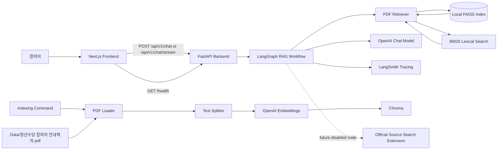
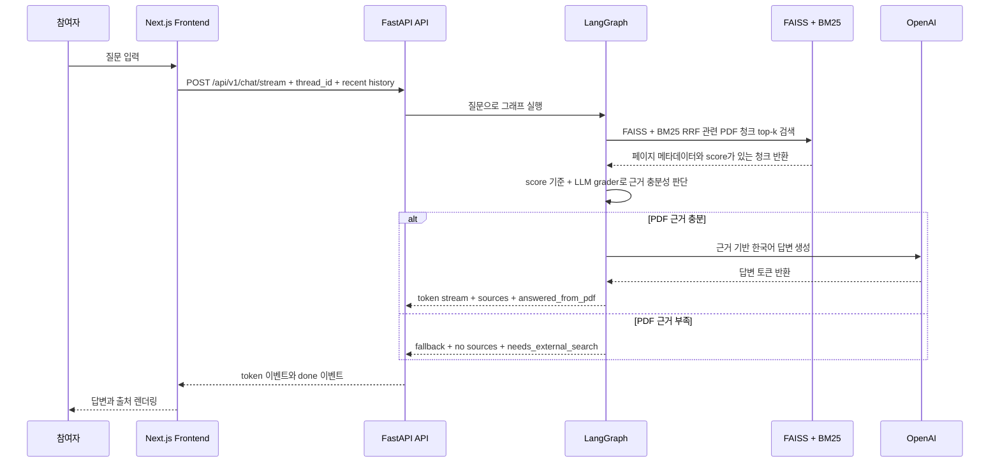
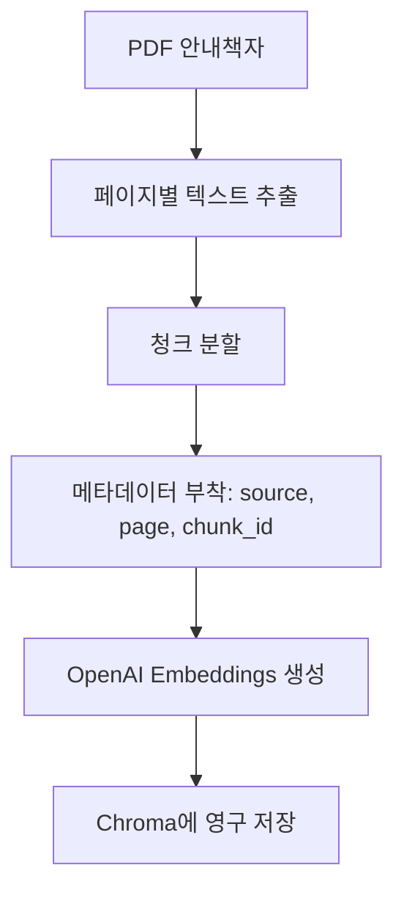
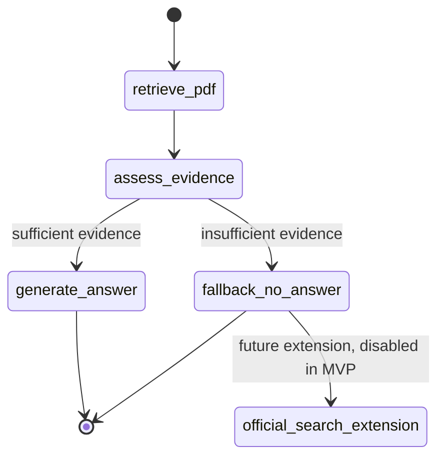

# 청년수당 RAG 챗봇 아키텍처

## 1. 아키텍처 요약

서비스는 로컬 MVP 기준으로 다음 요소로 구성된다.

- 참여자용 채팅 UI를 제공하는 Next.js 프론트엔드.
- API 라우팅과 RAG 실행을 담당하는 FastAPI 백엔드.
- PDF 로딩, 텍스트 분할, 임베딩, Chroma 연동을 담당하는 LangChain.
- 질문 처리 흐름을 상태 그래프로 관리하는 LangGraph.
- 로컬 영구 벡터 저장소인 Chroma.
- 임베딩과 답변 생성을 위한 OpenAI API.
- 설정된 경우 실행 추적을 남기는 LangSmith.

MVP의 답변 기준 문서는 `Data/청년수당 참여자 안내책자.pdf` 하나다.

## 2. 시스템 구성도



## 3. 런타임 채팅 흐름



## 4. Indexing 흐름

Indexing은 RAG 사전 준비 단계다. 이 프로젝트에서는 RAG에서 흔히 말하는 ingestion과 indexing을 같은 실무 흐름으로 본다.



채팅을 안정적으로 사용하려면 먼저 indexing 명령을 실행해야 한다. Chroma 인덱스가 없으면 백엔드는 `index_missing` 오류를 명확히 반환한다.

Indexing 명령은 성공 시 다음 검증 정보를 출력한다.

- 전체 페이지 수.
- 텍스트 추출 성공 페이지 수.
- 텍스트가 비어 있는 페이지 수.
- 전체 추출 문자 수.
- 생성된 청크 수.
- 샘플 청크와 해당 `page`, `chunk_id`.

빈 페이지가 과도하거나 전체 추출 문자 수가 너무 작으면 indexing은 실패해야 한다. MVP는 OCR을 포함하지 않으므로 이미지 기반 PDF는 별도 OCR 전처리가 필요하다는 오류를 반환한다.

## 5. LangGraph Workflow



### 노드 책임

- `retrieve_pdf`: Chroma에서 질문과 관련 있는 안내책자 청크를 검색한다.
- `assess_evidence`: 검색 score와 LLM grader를 함께 사용해 검색된 청크만으로 안전하게 답변할 수 있는지 판단한다.
- `generate_answer`: 검색된 PDF 근거만 사용해 한국어 답변을 생성한다.
- `fallback_no_answer`: 안내책자에서 답을 확인할 수 없을 때 안전한 fallback을 반환한다.
- `official_search_extension`: 향후 공식 출처 검색을 붙이기 위한 확장 노드다. MVP에서는 비활성화한다.

### 근거 충분성 판단 기준

`assess_evidence`는 다음 조건을 모두 만족할 때만 `answered_from_pdf`로 라우팅한다.

- `retrieve_pdf`가 최소 1개 이상의 청크를 반환한다.
- 상위 검색 결과의 similarity score가 최소 기준 이상이다.
- LLM evidence grader가 검색된 청크만으로 질문에 답할 수 있다고 판단한다.

초기 검색 설정은 top-k 5를 기본값으로 한다. similarity threshold는 구현 시 보수적으로 설정하고, 수동 검증 질문 결과를 기준으로 조정한다.

LLM evidence grader는 다음 구조를 반환한다.

```json
{
  "is_sufficient": true,
  "reason": "질문한 카드 사용처 기준이 검색된 청크에 직접 설명되어 있음",
  "source_chunk_ids": ["pdf-page-12-chunk-2"]
}
```

`generate_answer`는 `source_chunk_ids`에 포함된 청크만 근거로 사용한다. grader가 `is_sufficient: false`를 반환하면 `fallback_no_answer`로 이동한다.

## 6. 백엔드 책임

백엔드는 작은 모듈 단위로 책임을 나눈다.

### `indexing`

- 안내책자 PDF를 읽는다.
- 페이지 번호를 유지하며 텍스트를 추출한다.
- 텍스트를 검색 가능한 청크로 나눈다.
- 임베딩을 생성한다.
- 문서, 벡터, 메타데이터를 Chroma에 저장한다.
- 추출 품질 지표를 출력하고 비정상적인 추출 결과를 실패로 처리한다.

### `rag`

- Chroma retriever를 생성한다.
- 답변 프롬프트를 정의한다.
- 검색된 문서를 프론트엔드에 표시 가능한 source 객체로 정규화한다.
- top-k 같은 RAG 설정을 관리한다.

### `graph`

- LangGraph state를 정의한다.
- 그래프 노드를 구현한다.
- 답변 생성과 fallback 분기를 처리한다.
- 향후 공식 검색 확장 지점을 기존 PDF RAG 흐름과 분리한다.

### `api`

- FastAPI 라우트를 제공한다.
- 요청과 응답 스키마를 검증한다.
- 그래프 출력을 프론트엔드 친화적인 JSON으로 변환한다.
- 스트리밍 요청에서는 최종 생성 단계의 토큰을 `text/event-stream` 이벤트로 변환한다.
- 알려진 오류를 안정적인 error code로 반환한다.

## 7. 프론트엔드 책임

프론트엔드는 참여자용 채팅 경험에 집중하는 Next.js 앱이다.

### 주요 컴포넌트

- `ChatPage`: 메인 페이지와 브라우저 세션 대화 상태를 관리한다.
- `MessageList`: 사용자 메시지와 챗봇 메시지를 순서대로 표시한다.
- `ChatInput`: 질문 입력과 전송을 처리한다.
- `QuickQuestionBar`: 자주 묻는 질문 버튼을 표시한다.
- `SourceList`: 챗봇 답변 아래에 PDF 페이지와 excerpt를 표시한다.

### 상태 관리

대화 상태는 브라우저에만 둔다. MVP에서는 계정, 쿠키 기반 대화 복원, 서버 DB 저장을 사용하지 않는다.

## 8. 데이터 계약

### Chat Request

```json
{
  "question": "청년수당 카드는 어디에서 사용할 수 있나요?"
}
```

### Chat Response

성공 계열 응답은 HTTP 200을 사용한다. PDF 근거가 부족한 경우도 시스템 오류가 아니므로 HTTP 200으로 반환한다.

```json
{
  "answer": "청년수당 사용처는 안내책자의 사용 기준에 따라 확인해야 합니다...",
  "sources": [
    {
      "type": "pdf",
      "title": "청년수당 참여자 안내책자",
      "page": 12,
      "excerpt": "관련 문단 일부...",
      "chunk_id": "pdf-page-12-chunk-2"
    }
  ],
  "status": "answered_from_pdf",
  "needs_external_search": false
}
```

근거 부족 응답:

```json
{
  "answer": "안내책자에서 해당 내용을 확인하지 못했습니다. 최신 공식 안내 확인이 필요할 수 있습니다.",
  "sources": [],
  "status": "insufficient_pdf_evidence",
  "needs_external_search": true
}
```

### Chat Stream Response

`POST /api/v1/chat/stream`은 `/api/v1/chat`과 같은 요청 body를 받고 `text/event-stream`을 반환한다. 답변 본문은 `token` 이벤트로 누적하고, 출처와 상태는 마지막 `done` 이벤트에서 확정한다. 브라우저의 `thread_id`와 최근 대화는 요청 단위로만 사용하며 서버에 저장하지 않는다.

```text
event: token
data: {"text":"안내책자 근거로 "}

event: done
data: {"answer":"안내책자 근거로 확인한 답변입니다.","sources":[],"status":"answered_from_pdf","needs_external_search":false,"intent":"rag"}
```

### Error Response

실행 실패는 HTTP 오류 상태와 공통 error response를 사용한다. SSE 생성 중 실패도 같은 필드를 가진 `error` 이벤트로 반환한다.

```json
{
  "code": "index_missing",
  "message": "PDF 인덱스가 없습니다. 먼저 indexing 명령을 실행하세요."
}
```

권장 HTTP 매핑:

- `400 invalid_request`: 요청 형식이 잘못됨.
- `409 index_missing`: Chroma 인덱스가 없음.
- `500 generation_error`: OpenAI 또는 런타임 오류.
- `500 indexing_error`: indexing 실행 실패.

## 9. 권장 로컬 디렉터리 구조

```text
backend/
  app/
    api/
    graph/
    indexing/
    rag/
    core/
  storage/
    chroma/
frontend/
Data/
  청년수당 참여자 안내책자.pdf
docs/
  PRD.md
  architecture.md
```

`backend/storage/chroma`는 생성 가능한 로컬 데이터로 취급한다.

## 10. 설정

설정은 `.env`에서 읽는다.

예상 환경변수:

- `OPENAI_API_KEY`
- `LANGSMITH_API_KEY`
- `LANGSMITH_TRACING`
- `LANGSMITH_PROJECT`

애플리케이션은 secret 값을 출력하면 안 된다. LangSmith 설정이 없어도 로컬 개발은 가능해야 하며 `LANGSMITH_TRACING`의 기본값은 비활성화다. OpenAI 설정이 없으면 indexing 또는 답변 생성 시 명확히 실패해야 한다.

### 10.1 Redis cache 직렬화 경계

- 검색 결과는 `rag:v5` namespace에 `page_content`, JSON으로 정규화한
  `metadata`, `score`만 저장한다.
- pickle을 읽거나 쓰지 않는다. 이전 `rag:v4` 값은 조회 및 flush 대상에서 제외하고
  TTL에 따라 자연 만료시킨다.
- JSON 파싱 실패, schema/version 불일치, 예상하지 못한 타입은 cache miss다.
- Redis get/set/delete 장애는 검색 요청으로 전파하지 않는다.

### 10.2 FAISS 신뢰 경계와 PDF fallback cache

설치된 LangChain FAISS 포맷은 벡터 데이터 `index.faiss`와 docstore 및
index-to-document ID 매핑 `index.pkl`을 함께 로드한다. `FAISS.load_local`의
`allow_dangerous_deserialization=True`는 후자의 pickle 역직렬화 때문에 필요하다.
현행 인덱스에는 pickle을 대체하는 안전한 동등 파일이 없으므로 이번 단계에서는
포맷을 임의로 바꾸지 않는다.

위험 옵션을 사용하기 전에 다음 경계를 코드로 검사한다.

- 인덱스 디렉터리는 애플리케이션이 관리하는 `backend/` 루트 내부여야 한다.
- `index.faiss`와 `index.pkl`은 모두 존재하는 일반 파일이어야 하며 symlink는
  허용하지 않는다.
- 경로는 배포 설정으로만 정하며 요청 파라미터, 업로드 파일, 외부 URL에서 받지 않는다.
- 신뢰할 수 있는 빌드 과정에서 직접 생성한 인덱스만 배치한다. 다운로드했거나 출처와
  무결성을 검증하지 않은 인덱스는 로드하지 않는다.
- 검증 실패나 인덱스 손상은 PDF 텍스트 기반 BM25-only 경로로 격리한다.

BM25 fallback corpus는 프로세스별 LRU cache에 최대 4개 보관한다. cache key는
정규화된 PDF 경로, `st_mtime_ns`, 파일 크기이며 파일 상태가 바뀌면 재파싱한다.
서버 재시작 시 cache는 비워지고 디스크 산출물은 만들지 않는다.

### 10.3 운영 개인정보 로그 체크리스트

- 애플리케이션 로그에는 question, history, 전체 request body, 답변, LangGraph state,
  source 본문을 남기지 않는다.
- 오류 관측은 request_id, 오류 code, 처리 단계처럼 비식별 정보만 사용한다.
- thread_id가 꼭 필요할 때도 원문 대신 배포 계층에서 단방향 해시 또는 일부 마스킹을
  적용한다.
- LangSmith를 활성화하기 전 입력·출력 비저장 또는 마스킹 설정을 검토한다.
- reverse proxy와 API gateway에서 request/response body logging을 비활성화하고
  access log에는 경로, 상태 코드, 지연 시간만 남긴다.
- debug logging은 운영 기본값에서 비활성화하고 보존 기간과 접근 권한을 정한다.

## 11. 오류 처리

알려진 오류는 다음과 같다.

- PDF 파일 없음.
- PDF 텍스트 추출 실패.
- PDF 텍스트 추출 품질 부족.
- Chroma 인덱스 없음.
- OpenAI API 실패.
- rate limit 또는 네트워크 실패.
- 프론트엔드에서 백엔드 연결 실패.
- PDF 근거 부족.

프론트엔드는 stack trace나 secret 설정을 노출하지 않고 사용자에게 이해 가능한 오류 메시지를 보여준다.

## 12. 테스트 전략

백엔드 테스트는 다음을 확인한다.

- indexing이 Chroma 데이터를 생성한다.
- indexing이 페이지 수, 빈 페이지 수, 추출 문자 수, 청크 수를 출력한다.
- 텍스트 추출 결과가 비정상적으로 작으면 indexing이 실패한다.
- 청크 메타데이터에 `source`, `page`, `chunk_id`가 포함된다.
- `/health`가 `ok`를 반환한다.
- `/chat`이 answer, sources, status, `needs_external_search`를 반환한다.
- `/chat/stream`이 답변 `token` 이벤트와 최종 `done` 이벤트를 반환한다.
- 근거가 부족하면 `insufficient_pdf_evidence`를 반환한다.
- 근거가 부족한 질문에서는 일반 지식 답변을 생성하지 않는다.
- 인덱스가 없으면 안정적인 `index_missing` 오류를 반환한다.

프론트엔드 테스트 또는 수동 검증은 다음을 확인한다.

- FAQ 빠른 질문 버튼이 채팅 요청을 보낸다.
- 사용자 메시지와 챗봇 답변이 순서대로 표시된다.
- 출처 목록이 챗봇 답변 아래에 표시된다.
- 요청 중 로딩 상태가 표시된다.
- 백엔드 연결 실패 시 오류 상태가 표시된다.
- 새로고침하면 채팅 기록이 사라진다.
