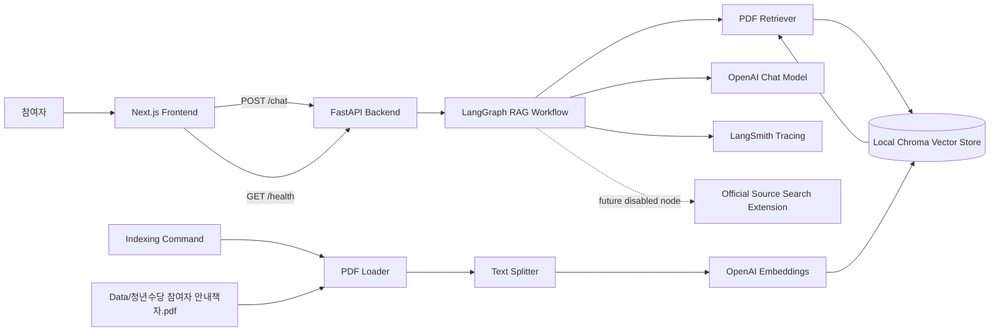
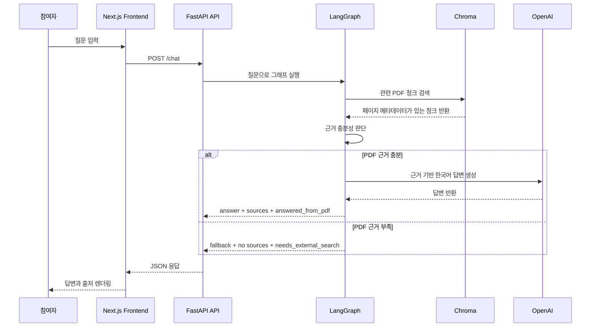
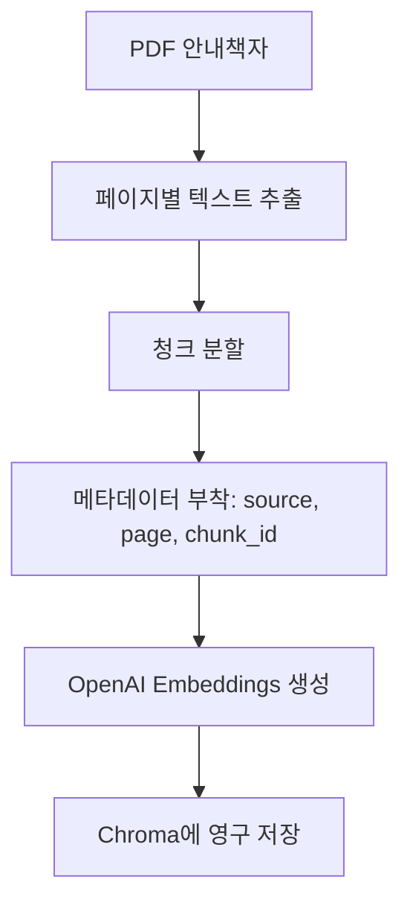
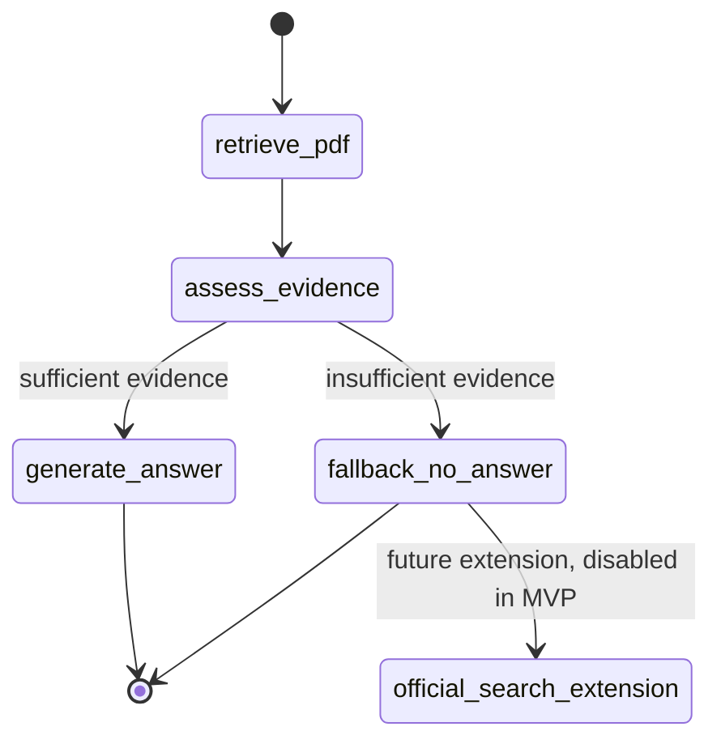

# 청년수당 RAG 챗봇 아키텍처

## 1. 아키텍처 요약

서비스는 로컬 MVP 기준으로 다음 요소로 구성된다.

- 참여자용 채팅 UI를 제공하는 Next.js 프론트엔드.
- API 라우팅과 RAG 실행을 담당하는 FastAPI 백엔드.
- PDF 로딩, 텍스트 분할, 임베딩, Chroma 연동을 담당하는 LangChain.
- 질문 처리 흐름을 상태 그래프로 관리하는 LangGraph.
- 로컬 영구 벡터 저장소인 Chroma.
- 임베딩과 답변 생성을 위한 OpenAI API.
- 설정된 경우 실행 추적을 남기는 LangSmith.

MVP의 답변 기준 문서는 `Data/청년수당 참여자 안내책자.pdf` 하나다.

## 2. 시스템 구성도



## 3. 런타임 채팅 흐름



## 4. Indexing 흐름

Indexing은 RAG 사전 준비 단계다. 이 프로젝트에서는 RAG에서 흔히 말하는 ingestion과 indexing을 같은 실무 흐름으로 본다.



채팅을 안정적으로 사용하려면 먼저 indexing 명령을 실행해야 한다. Chroma 인덱스가 없으면 백엔드는 `index_missing` 오류를 명확히 반환한다.

## 5. LangGraph Workflow



### 노드 책임

- `retrieve_pdf`: Chroma에서 질문과 관련 있는 안내책자 청크를 검색한다.
- `assess_evidence`: 검색된 청크만으로 안전하게 답변할 수 있는지 판단한다.
- `generate_answer`: 검색된 PDF 근거만 사용해 한국어 답변을 생성한다.
- `fallback_no_answer`: 안내책자에서 답을 확인할 수 없을 때 안전한 fallback을 반환한다.
- `official_search_extension`: 향후 공식 출처 검색을 붙이기 위한 확장 노드다. MVP에서는 비활성화한다.

## 6. 백엔드 책임

백엔드는 작은 모듈 단위로 책임을 나눈다.

### `indexing`

- 안내책자 PDF를 읽는다.
- 페이지 번호를 유지하며 텍스트를 추출한다.
- 텍스트를 검색 가능한 청크로 나눈다.
- 임베딩을 생성한다.
- 문서, 벡터, 메타데이터를 Chroma에 저장한다.

### `rag`

- Chroma retriever를 생성한다.
- 답변 프롬프트를 정의한다.
- 검색된 문서를 프론트엔드에 표시 가능한 source 객체로 정규화한다.
- top-k 같은 RAG 설정을 관리한다.

### `graph`

- LangGraph state를 정의한다.
- 그래프 노드를 구현한다.
- 답변 생성과 fallback 분기를 처리한다.
- 향후 공식 검색 확장 지점을 기존 PDF RAG 흐름과 분리한다.

### `api`

- FastAPI 라우트를 제공한다.
- 요청과 응답 스키마를 검증한다.
- 그래프 출력을 프론트엔드 친화적인 JSON으로 변환한다.
- 알려진 오류를 안정적인 error code로 반환한다.

## 7. 프론트엔드 책임

프론트엔드는 참여자용 채팅 경험에 집중하는 Next.js 앱이다.

### 주요 컴포넌트

- `ChatPage`: 메인 페이지와 브라우저 세션 대화 상태를 관리한다.
- `MessageList`: 사용자 메시지와 챗봇 메시지를 순서대로 표시한다.
- `ChatInput`: 질문 입력과 전송을 처리한다.
- `QuickQuestionBar`: 자주 묻는 질문 버튼을 표시한다.
- `SourceList`: 챗봇 답변 아래에 PDF 페이지와 excerpt를 표시한다.

### 상태 관리

대화 상태는 브라우저에만 둔다. MVP에서는 계정, 쿠키 기반 대화 복원, 서버 DB 저장을 사용하지 않는다.

## 8. 데이터 계약

### Chat Request

```json
{
  "question": "청년수당 카드는 어디에서 사용할 수 있나요?"
}
```

### Chat Response

```json
{
  "answer": "청년수당 사용처는 안내책자의 사용 기준에 따라 확인해야 합니다...",
  "sources": [
    {
      "type": "pdf",
      "title": "청년수당 참여자 안내책자",
      "page": 12,
      "excerpt": "관련 문단 일부...",
      "chunk_id": "pdf-page-12-chunk-2"
    }
  ],
  "status": "answered_from_pdf",
  "needs_external_search": false
}
```

### Error Response

```json
{
  "error": "index_missing",
  "message": "PDF 인덱스가 없습니다. 먼저 indexing 명령을 실행하세요."
}
```

## 9. 권장 로컬 디렉터리 구조

```text
backend/
  app/
    api/
    graph/
    indexing/
    rag/
    core/
  storage/
    chroma/
frontend/
Data/
  청년수당 참여자 안내책자.pdf
docs/
  PRD.md
  architecture.md
```

`backend/storage/chroma`는 생성 가능한 로컬 데이터로 취급한다.

## 10. 설정

설정은 `.env`에서 읽는다.

예상 환경변수:

- `OPENAI_API_KEY`
- `LANGSMITH_API_KEY`
- `LANGSMITH_TRACING`
- `LANGSMITH_PROJECT`

애플리케이션은 secret 값을 출력하면 안 된다. LangSmith 설정이 없어도 로컬 개발은 가능해야 한다. OpenAI 설정이 없으면 indexing 또는 답변 생성 시 명확히 실패해야 한다.

## 11. 오류 처리

알려진 오류는 다음과 같다.

- PDF 파일 없음.
- PDF 텍스트 추출 실패.
- Chroma 인덱스 없음.
- OpenAI API 실패.
- rate limit 또는 네트워크 실패.
- 프론트엔드에서 백엔드 연결 실패.
- PDF 근거 부족.

프론트엔드는 stack trace나 secret 설정을 노출하지 않고 사용자에게 이해 가능한 오류 메시지를 보여준다.

## 12. 테스트 전략

백엔드 테스트는 다음을 확인한다.

- indexing이 Chroma 데이터를 생성한다.
- 청크 메타데이터에 `source`, `page`, `chunk_id`가 포함된다.
- `/health`가 `ok`를 반환한다.
- `/chat`이 answer, sources, status, `needs_external_search`를 반환한다.
- 근거가 부족하면 `insufficient_pdf_evidence`를 반환한다.
- 인덱스가 없으면 안정적인 `index_missing` 오류를 반환한다.

프론트엔드 테스트 또는 수동 검증은 다음을 확인한다.

- FAQ 빠른 질문 버튼이 채팅 요청을 보낸다.
- 사용자 메시지와 챗봇 답변이 순서대로 표시된다.
- 출처 목록이 챗봇 답변 아래에 표시된다.
- 요청 중 로딩 상태가 표시된다.
- 백엔드 연결 실패 시 오류 상태가 표시된다.
- 새로고침하면 채팅 기록이 사라진다.

